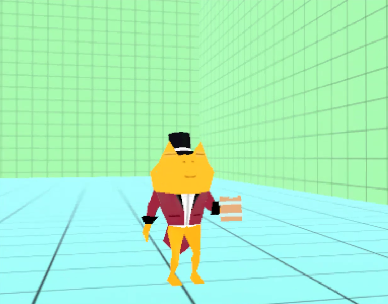
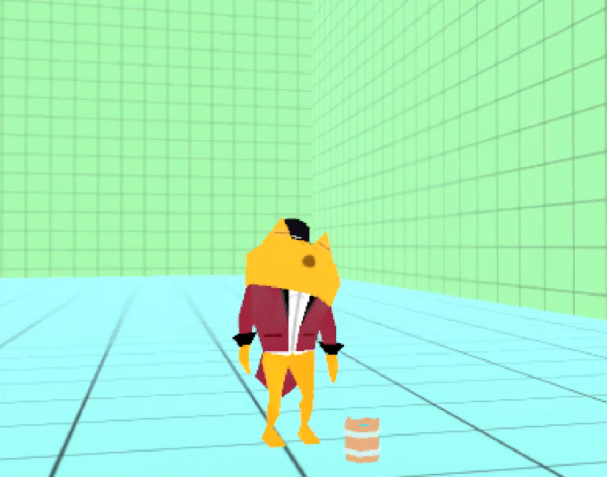
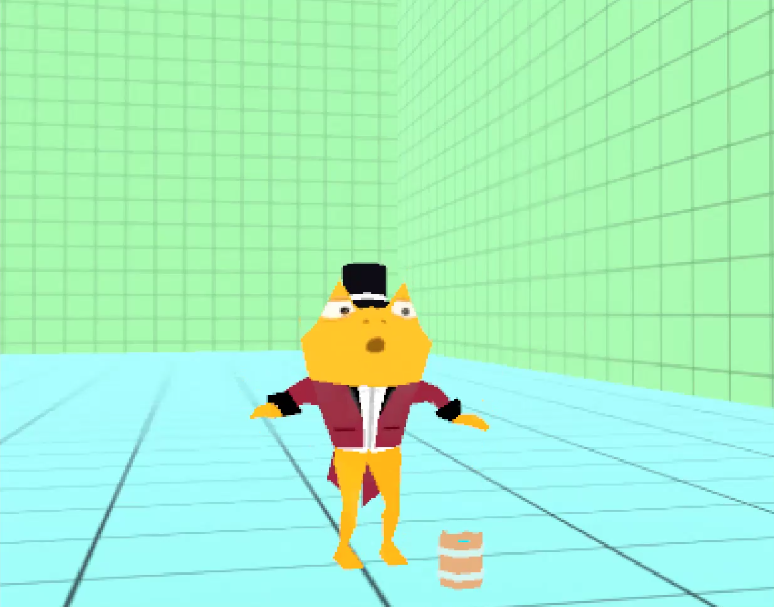
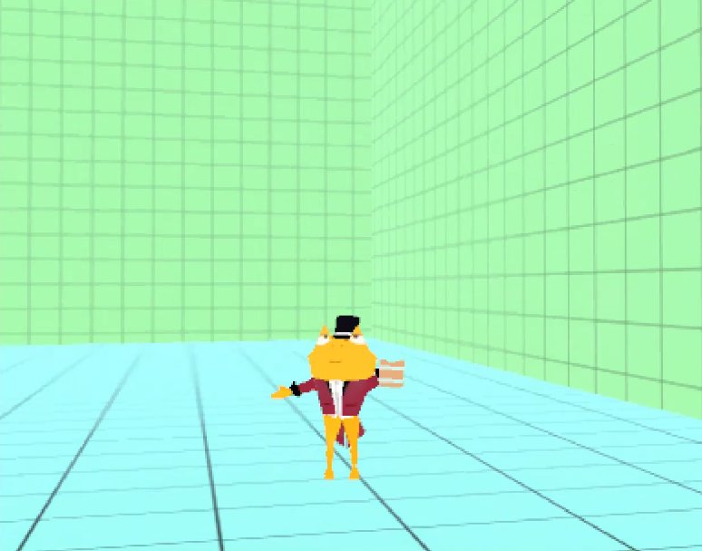
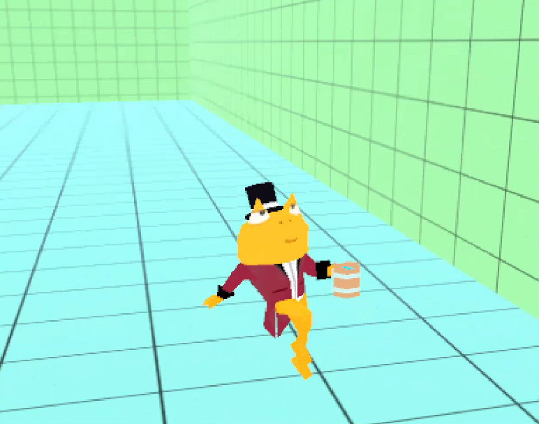
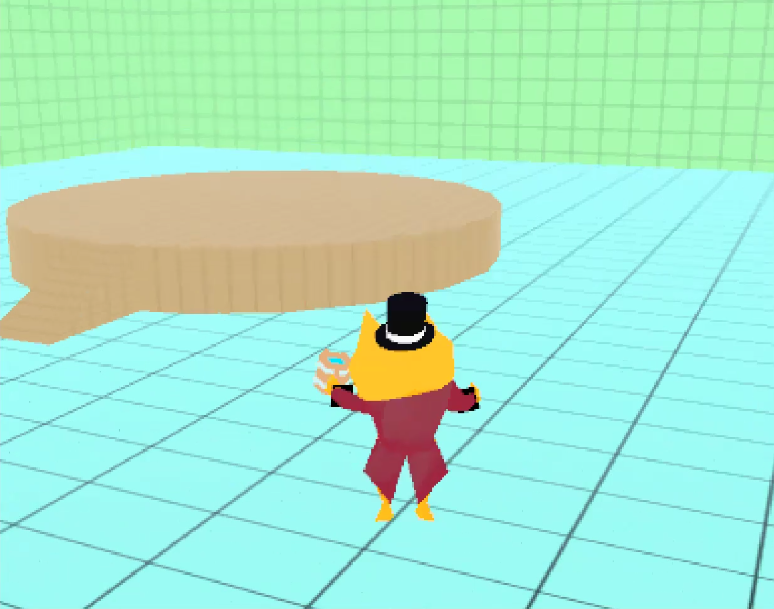

# 🐸 Hopscotch the Show Frog – 3D Platformer Demo

A 3D platformer prototype showcasing a fully animated mascot character built in Unity.

This project includes character modeling, rigging, and animation created in **Blender**, with expressive facial texture animations made in **Unity**.

---

## 🎭 Character Bio

**Hopscotch the Show Frog**  
A dry-witted, horned frog who leads a travelling circus troupe. Formerly a well-dweller, he now journeys to experience the wider world. Despite his seemingly unbothered exterior, he's prone to homesickness and always carries a special tankard of water from his home to soothe his nerves during performances.

At the end of each show, Hopscotch performs a **signature toast** — a heartfelt tribute to his origins and a gesture of gratitude to his audience.

---

## 📸 Screenshots

Here’s a preview of Hopscotch in action:

  
  
  

  
  
  

---

## 🕹️ Download the Demo

You can download and play the demo for **Mac and Windows** from the link below:

🔗 [Download Build (Dropbox)](https://www.dropbox.com/scl/fo/i6no409g0s6zamk3f85tt/AMZ5GpidqcwPxfx2w6rrFUY?rlkey=2yap94vhws2satiwfwg9hx0u2&st=ndjxtnlu&dl=0)

---
 
